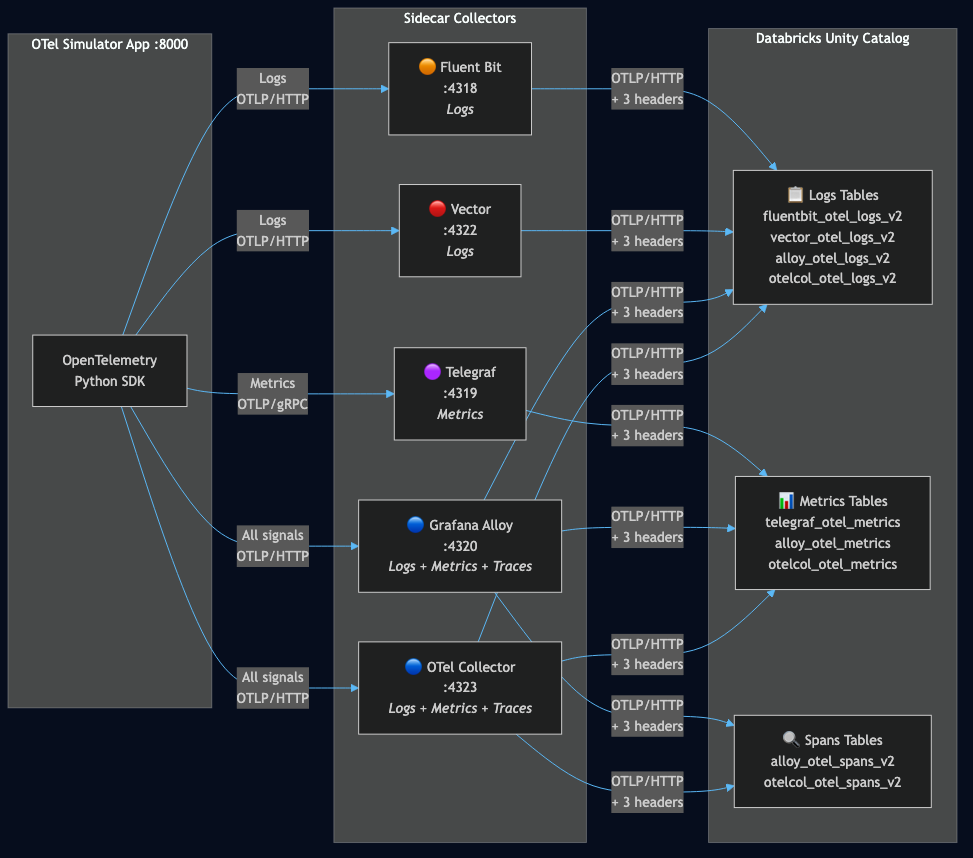

# OTel Simulator — 5 Collectors to Databricks

An OpenTelemetry simulator that demonstrates how five different open-source collectors can forward telemetry to Databricks Unity Catalog. Each collector handles the signal types it's purpose-built for.

## Collector-to-Signal Mapping

| Collector | Logs | Metrics | Traces | Rationale |
|-----------|:----:|:-------:|:------:|-----------|
| **Fluent Bit** | Yes | - | - | Purpose-built log processor. ~1MB footprint, 300+ plugins, de facto standard for K8s log collection. |
| **Telegraf** | - | Yes | - | Purpose-built metrics agent. 300+ input plugins, native gRPC OTLP support, widely deployed for infrastructure monitoring. |
| **Grafana Alloy** | Yes | Yes | Yes | Full OTel-native collector. Handles all signals with component-based pipelines. Best fit for Grafana ecosystem teams. |
| **Vector** | Yes | - | - | High-performance Rust-based pipeline. Excels at log collection and transformation (VRL). OTLP metrics forwarding has limitations. |
| **OTel Collector** | Yes | Yes | Yes | The CNCF reference implementation. Vendor-neutral, handles all signals, 200+ community components. The standard choice for greenfield OTel. |

**The thesis:** Databricks exposes standard OTLP endpoints. Whatever collector you're already running, you can add a Databricks output — same three headers, data lands in Unity Catalog.

## Architecture



```
                              ┌─────────────────────────────────────────────────────────┐
                              │              Sidecar Collectors (localhost)              │
                              │                                                         │
                              │  ┌─────────────┐  ┌─────────────┐  ┌────────────────┐  │
                     ┌───────→│  │ Fluent Bit   │  │   Vector    │  │ Grafana Alloy  │  │
                     │  OTLP  │  │ :4318        │  │   :4322     │  │ :4320          │  │
┌──────────────┐     │  HTTP  │  │ (logs)       │  │   (logs)    │  │ (all signals)  │  │
│  OTel        │     │        │  └──────┬───────┘  └──────┬──────┘  └───────┬────────┘  │
│  Simulator   │  Logs        │         │                 │                 │            │
│  App         │─────┘        │         │                 │                 │            │
│              │              │  ┌──────┴───────┐                  ┌───────┴────────┐   │
│  (FastAPI    │  Metrics     │  │  Telegraf    │                  │ OTel Collector │   │
│   :8000)     │──────────────│  │  :4319       │                  │ :4323          │   │
│              │  OTLP gRPC   │  │  (metrics)   │                  │ (all signals)  │   │
│              │              │  └──────┬───────┘                  └───────┬────────┘   │
│              │  Traces      │         │                                  │            │
│              │──────────────│         │                                  │            │
└──────────────┘  OTLP HTTP   └─────────│──────────────────────────────────│────────────┘
                                        │                                  │
                                        │      OTLP/HTTP over TLS         │
                                        │      + 3 Databricks headers     │
                                        ▼                                  ▼
                              ┌─────────────────────────────────────────────────────────┐
                              │  Databricks Workspace                                   │
                              │                                                         │
                              │  OTLP Ingest Endpoints:                                 │
                              │    /api/2.0/tracing/otel/v1/traces                      │
                              │    /api/2.0/tracing/otel/v1/logs                        │
                              │    /api/2.0/otel/v1/metrics                             │
                              │                                                         │
                              │  Headers:                                               │
                              │    Authorization: Bearer <token>                        │
                              │    X-Databricks-UC-Table-Name: <catalog.schema.table>   │
                              │    X-Databricks-Workspace-Url: <host>                   │
                              │                                                         │
                              │  Unity Catalog: telemetry.otel                          │
                              │  ┌───────────────────────────────────────────────────┐  │
                              │  │ fluentbit_otel_logs_v2    alloy_otel_logs_v2     │  │
                              │  │ vector_otel_logs_v2       otelcol_otel_logs_v2   │  │
                              │  │ telegraf_otel_metrics     alloy_otel_metrics     │  │
                              │  │ otelcol_otel_metrics      alloy_otel_spans_v2    │  │
                              │  │ otelcol_otel_spans_v2                             │  │
                              │  └───────────────────────────────────────────────────┘  │
                              └─────────────────────────────────────────────────────────┘
```

### Signal Fan-out

Each event emitted by the simulator fans out to every collector that handles that signal type:

| Signal | Collectors | Ports |
|--------|-----------|-------|
| **Logs** | Fluent Bit, Vector, Grafana Alloy, OTel Collector | :4318, :4322, :4320, :4323 |
| **Metrics** | Telegraf, Grafana Alloy, OTel Collector | :4319, :4320, :4323 |
| **Traces** | Grafana Alloy, OTel Collector | :4320, :4323 |

### How It Works

1. **The app emits telemetry using the OpenTelemetry Python SDK** — traces, logs, and metrics via OTLP exporters. Multiple exporters per signal fan out to all capable collectors.

2. **In sidecar mode** (`OTEL_SIDECAR_MODE=true`), each signal routes to every collector that handles it. The OTel SDK natively supports multiple span processors, log processors, and metric readers.

3. **Each collector receives OTLP data and forwards it** to the Databricks OTLP ingest endpoint, injecting the three required headers: `Authorization`, `X-Databricks-UC-Table-Name`, `X-Databricks-Workspace-Url`.

4. **Data lands in Unity Catalog** in `telemetry.otel`, with each table prefixed by the collector name — so you can compare how each collector delivers the same telemetry.

## Quick Start

### 1. Install collectors

```bash
./collectors/install.sh
```

Installs Fluent Bit, Telegraf, Grafana Alloy, Vector, and OTel Collector.

### 2. Create tables

Run `sql/setup_otel_tables.sql` against your Databricks workspace to create the 9 target tables in `telemetry.otel`.

### 3. Configure environment

```bash
cp .env.example .env
# Edit .env — set DATABRICKS_HOST and DATABRICKS_TOKEN
```

### 4. Run everything

```bash
./start-sidecars.sh
```

Launches all 5 collectors and the app. Open `http://localhost:8000` to use the simulator.

Press `Ctrl+C` to stop all processes.

### Direct Mode (no sidecars)

To bypass the collectors and send directly to Databricks:

```bash
# In .env
OTEL_SIDECAR_MODE=false
```

Then run the app standalone:

```bash
cd app_otel_sim
uvicorn backend.server:app --port 8000
```

## Repo Structure

```
├── start-sidecars.sh              # Launch all 5 collectors + app
├── .env.example                   # Environment config template
├── databricks.yml                 # Databricks bundle config
│
├── app_otel_sim/                  # Simulator app (FastAPI)
│   ├── backend/
│   │   ├── emitter.py             # OTel SDK setup + fan-out routing
│   │   ├── server.py              # API endpoints + sidecar health
│   │   ├── scenarios.py           # Enterprise event topologies
│   │   └── models.py              # Response models
│   └── frontend/                  # Static HTML/JS/CSS UI
│
├── app_otel_ops/                  # Operational dashboard (read-only)
│   ├── backend/                   # SQL queries against UC tables
│   └── frontend/                  # Dashboard UI
│
├── collectors/                    # Sidecar collector configs
│   ├── install.sh                 # Install all 5 collectors
│   ├── fluent-bit/
│   │   └── fluent-bit.yaml        # Fluent Bit (logs)
│   ├── telegraf/
│   │   └── telegraf.conf          # Telegraf (metrics)
│   ├── alloy/
│   │   └── config.alloy           # Grafana Alloy (logs + metrics + traces)
│   ├── vector/
│   │   └── vector.yaml            # Vector (logs)
│   └── otel-collector/
│       └── otel-collector.yaml    # OTel Collector (logs + metrics + traces)
│
├── sql/
│   └── setup_otel_tables.sql      # Create 9 tables in telemetry.otel
│
├── notebooks/                     # Jupyter notebooks for testing
└── reference/                     # Reference OTel implementation
```

## Target Tables

All 9 tables in `telemetry.otel`, prefixed by collector:

| Table | Collector | Signal |
|-------|-----------|--------|
| `fluentbit_otel_logs_v2` | Fluent Bit | Logs |
| `vector_otel_logs_v2` | Vector | Logs |
| `alloy_otel_logs_v2` | Grafana Alloy | Logs |
| `otelcol_otel_logs_v2` | OTel Collector | Logs |
| `telegraf_otel_metrics` | Telegraf | Metrics |
| `alloy_otel_metrics` | Grafana Alloy | Metrics |
| `otelcol_otel_metrics` | OTel Collector | Metrics |
| `alloy_otel_spans_v2` | Grafana Alloy | Traces |
| `otelcol_otel_spans_v2` | OTel Collector | Traces |
